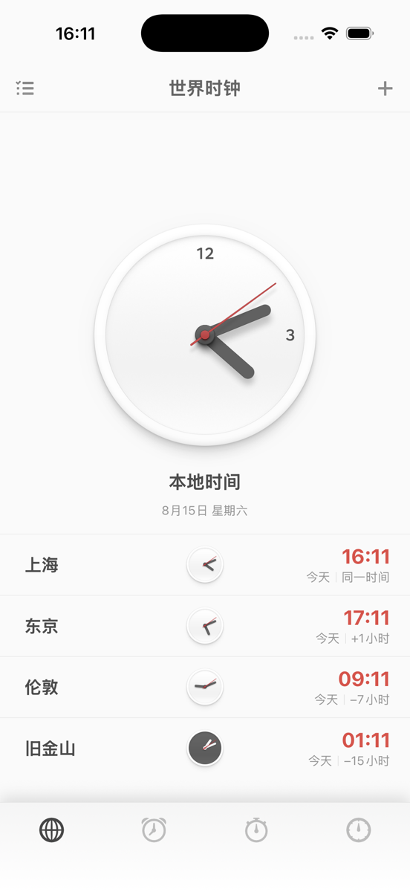
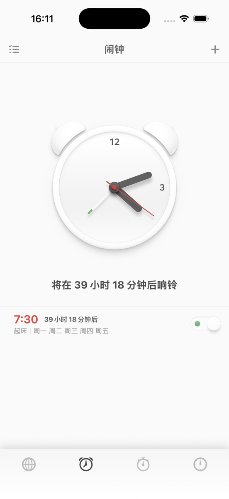
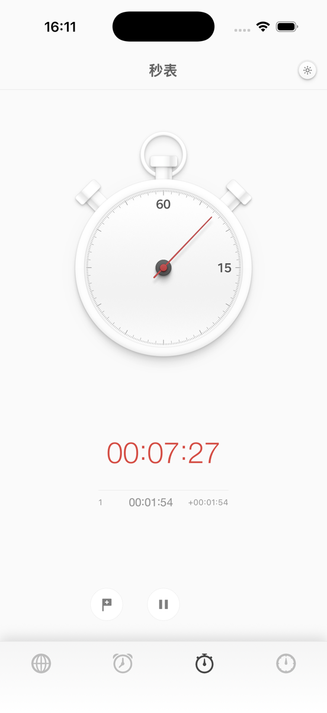
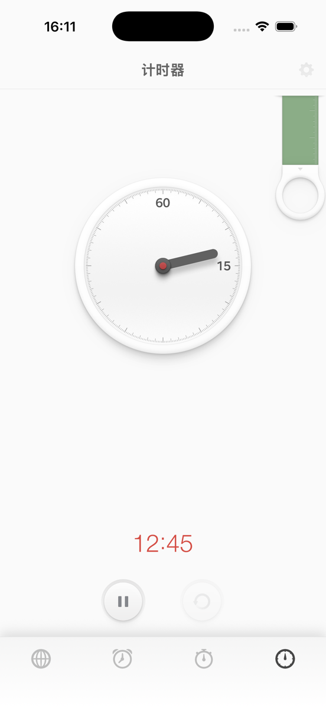
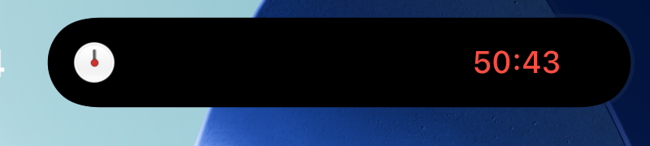

# 锤子时钟 iOS（Smartisan Clock iOS）

一个面向 iPhone 的非官方、非商业、源码公开的锤子时钟体验复刻。项目使用 SwiftUI 与 AlarmKit 重写，保留世界时钟、闹钟、机械秒表，以及经典下拉环和新版滑尺两套计时器。

> 本项目与锤子科技、字节跳动、Smartisan 品牌及其权利人没有隶属、合作、授权或背书关系。请先阅读[知识产权与免责声明](#知识产权与免责声明)。

## 下载

- [下载最新 Release 与未签名 IPA](https://github.com/jingweipro/SmartisanClock-iOS/releases/latest)
- [查看 IPA 安装与自签说明](INSTALL.md)

Release 中的 `unsigned.ipa` **没有可直接安装的 Apple 签名**。使用者需要用自己的 Apple Account、开发证书和描述文件重新签名，或者直接在 Xcode 中编译安装。不要把 Apple Account 密码提交给来历不明的网站或证书服务。

## 操作视频与界面预览

🎬 视频演示： [Bilibili](https://www.bilibili.com/video/BV1BEgu67Ewx/) · [抖音](https://v.douyin.com/M38BGGUuntM/)

两个视频都展示了项目的主要页面与操作流程；下面是当前公开版本在 iPhone 模拟器中的界面截图。

<p align="center">
  
  
  
  
</p>

<p align="center"><sub>世界时钟 · 闹钟 · 机械秒表 · 计时器</sub></p>

## 最新进展（2026-08-22）

本次主分支更新重点改进了计时器的连续性、滑尺操作和系统实时活动：

- 倒计时在 App 退出或被结束后仍由 AlarmKit 继续管理，重新打开时可恢复正确的剩余时间与运行状态。
- 新增锁屏与灵动岛计时器，支持暂停、继续和停止，并统一为机械表盘、红色数字与拟物按键的视觉语言。
- 优化水平滑尺跟手性和表盘联动，并将滑尺计时范围限定为 1–60 分钟。
- 增加计时会话、滑尺规则、URL 操作和模拟器恢复测试，并已在实体 iPhone 安装验证。

<p align="center">
  
</p>

<p align="center"><sub>灵动岛紧凑状态：机械小表盘与实时剩余时间</sub></p>

完整的分类更新内容见 [CHANGELOG.md](CHANGELOG.md)。这些改动已进入主分支，下载页中的 IPA 仍以 Release 标注的版本为准。

## 系统要求

- iPhone，iOS 26.0 或更高版本
- 闹钟和计时提醒需要用户授予 AlarmKit 权限
- 通过非 App Store 方式安装时，需要开启开发者模式并保持签名有效

## 当前功能

- 世界时钟、本地城市库、城市搜索与机械小表盘
- 闹钟列表、时间选择、重复、铃声、标签与系统 AlarmKit 调度
- 机械秒表、圈次、按键音效与指针动画
- 经典下拉环计时器与新版水平滑尺计时器
- 倒计时在 App 被结束后可以恢复，并提供锤子风格锁屏与灵动岛实时活动
- 原式底栏、机械表盘、字体、声音及交互动效
- 支持系统默认、深色和透明玻璃图标外观

## 从源码运行

1. 安装 Xcode 26.2 或更高版本。
2. 打开 `SmartisanClockiOS.xcodeproj`。
3. 在 Target 的 **Signing & Capabilities** 中选择自己的 Team；必要时将 Bundle Identifier 改为自己的唯一值。
4. 选择 iOS 26+ 模拟器或已连接并开启开发者模式的 iPhone。
5. 点击 Run。

Apple 官方也支持使用未加入付费开发者计划的 Personal Team 在自己的设备上测试，但免费描述文件通常 7 天到期，并存在设备与 App 数量限制，详见[Apple Developer Account Help](https://developer.apple.com/help/account/basics/about-your-developer-account)。

维护者可用以下脚本生成不包含证书和描述文件的 Release IPA：

```bash
./scripts/build-unsigned-ipa.sh /tmp/SmartisanClockRelease
```

## 隐私

当前版本不包含账号系统、广告、分析 SDK 或网络请求。闹钟、计时器和城市数据保存在设备本地，系统闹钟由 AlarmKit 管理。完整说明见 [PRIVACY.md](PRIVACY.md)。第三方签名、安装或证书服务有自己的隐私政策，不属于本项目控制范围。

## 致谢

本项目重点参考了 [Mangi-11/SmartisanClock-Revived](https://github.com/Mangi-11/SmartisanClock-Revived)。感谢作者 [Mangi-11（蛮吉）](https://github.com/Mangi-11) 对现代 Android 版的重写、基线资料整理，以及对经典拉环、新版滑尺、机械动画和交互细节的研究。

根据上游项目的致谢，也感谢 [People-11](https://github.com/People-11/) 为上游研究提供坚果 R2 原厂 Clock 7.1.1 APK、系统框架和测试反馈。这些资料帮助复刻工作核对原始视觉与行为。

也向 Smartisan OS 原时钟的设计、产品、动画、声音和工程团队致意；本项目是对这套数字拟物体验的个人学习、研究与保存。

## 知识产权与免责声明

- `Smartisan`、锤子科技、字节跳动及相关名称、商标、视觉设计的权利归各自权利人所有。
- 本仓库中的原创 Swift 源码与原创文档按 [MIT License](LICENSE) 提供；该许可证**不覆盖**第三方图像、图标、字体、声音、商标、视觉设计或上游资料。
- `SmartisanClockiOS/SmartisanAssets`、App 图标及相关复刻素材仅随项目用于个人学习、研究、兼容性测试和旧软件体验保存，不授予商业使用、再许可或商标使用权。
- 非商业、个人兴趣或免责声明本身不等于获得第三方版权授权。下载者、构建者和分发者应自行确认其所在地法律与相应权利要求。
- 如果你是相关权利人并希望更正署名、补充来源或移除内容，请通过 [GitHub Issue](https://github.com/jingweipro/SmartisanClock-iOS/issues/new) 联系，维护者会优先处理。

详细来源与许可边界见 [THIRD_PARTY_NOTICES.md](THIRD_PARTY_NOTICES.md)。

## 使用风险

本项目按“现状”提供，不承诺适用于医疗、消防、出行、考试、工作值守或其他关键提醒。闹钟可能受系统版本、权限、静音/音量设置、签名过期及后台策略影响；依赖前请在自己的设备上充分测试。未签名 IPA 必须由使用者自行签名，签名失败、证书撤销、数据丢失或第三方安装工具带来的风险由使用者自行承担。

安全问题与校验建议见 [SECURITY.md](SECURITY.md)。
